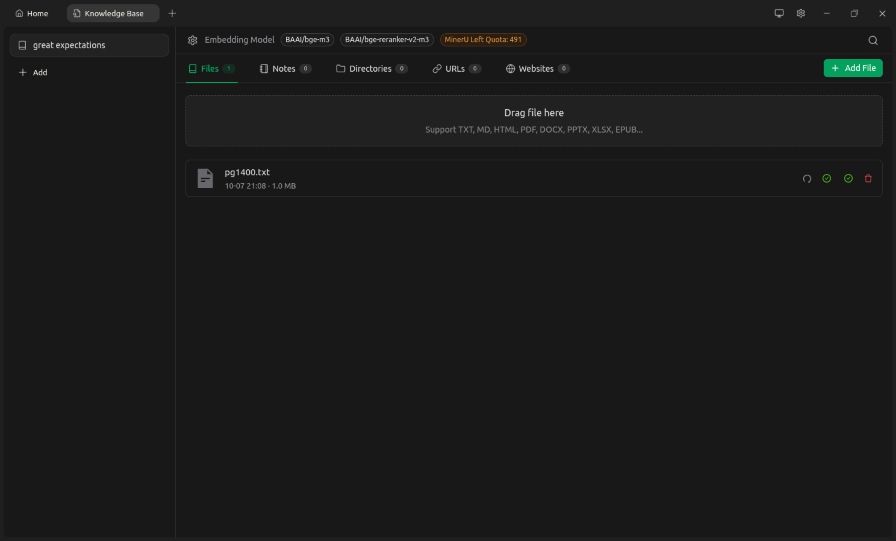
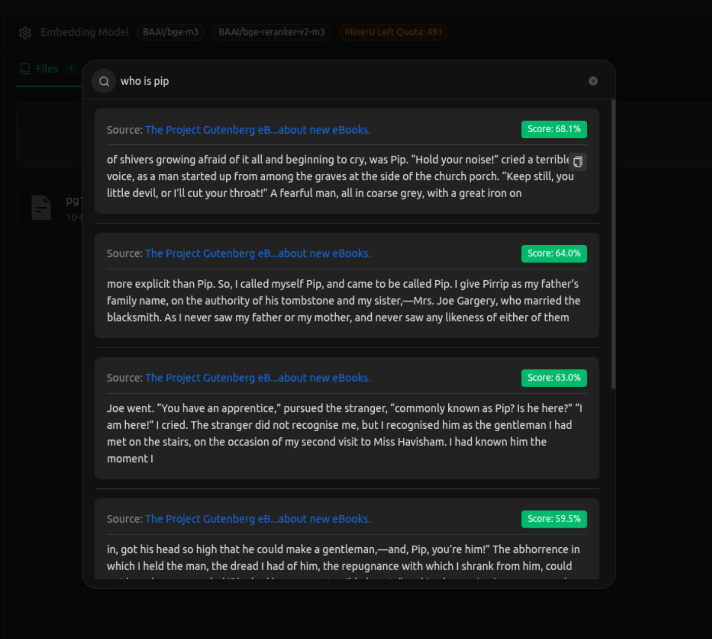

# Assignment 06: Great Expectations

This repository showcases the results of a data query and the structure of a Great Expectations knowledge base.

## Great Expectations Knowledge Base

The following diagram illustrates the relationships and components within the Great Expectations framework as implemented in this project.

## Query Result

This image displays the output from a specific query executed on the dataset.

